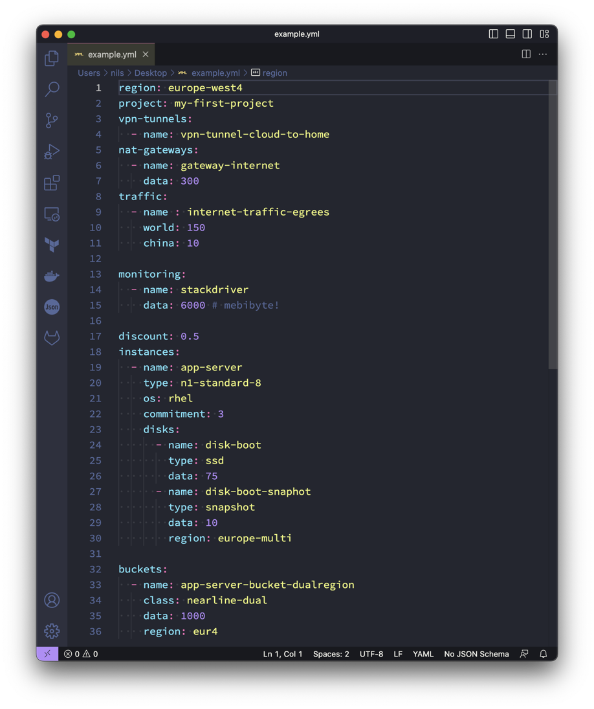
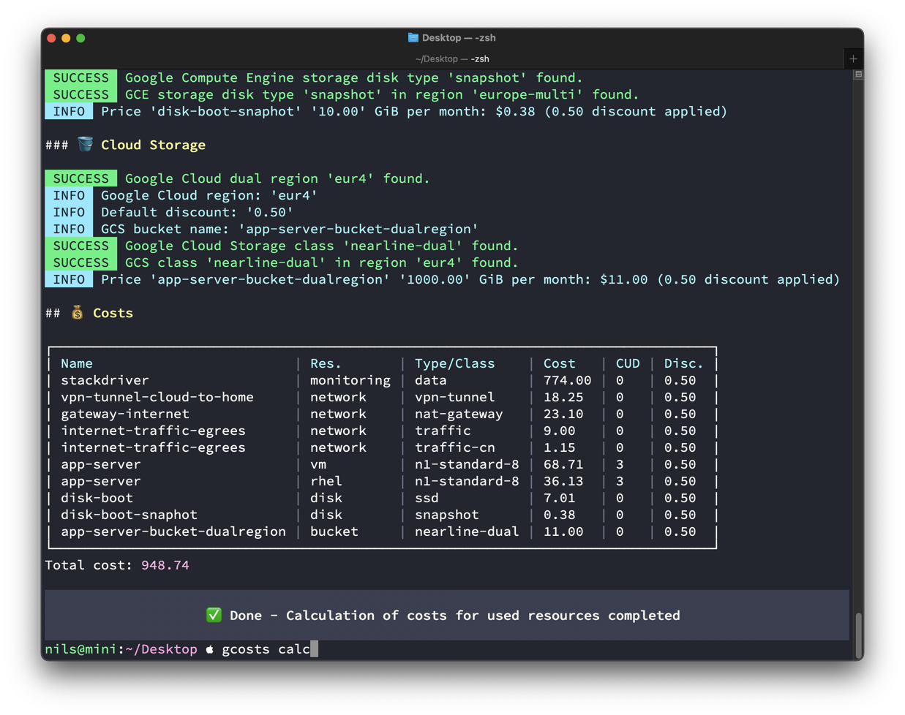
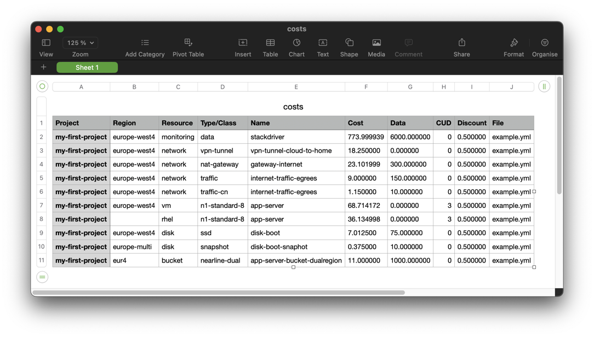

# Google Cloud Platform Pricing and Cost Calculator

[](#readme)
[](#readme)
[](#-quick-start)
[](#-quick-start)
[](#-quick-start)
[](https://github.com/Cyclenerd/google-cloud-pricing-cost-calculator/actions/workflows/test.yml)
[](https://github.com/Cyclenerd/google-cloud-pricing-cost-calculator/blob/master/LICENSE)

| 🏆 Awarded |
|------------------------------------------------|
| This project was [Google Open Source Peer Bonus](https://opensource.googleblog.com/2022/09/announcing-the-second-group-of-open-source-peer-bonus-winners-in-2022.html) winner in 2022 🥳 |

Calculate estimated monthly costs of Google Cloud Platform products and resources.
Optimized for DevOps, architects and engineers to quickly see a cost breakdown and compare different options upfront:

* Mapping of resource usage is done in easy to learn **YAML** usage files
* Price information is read from a local file (`pricing.yml`)
* Calculation is done via `gcosts` **CLI** program
* Calculated costs are saved in **CSV** file optimized for non-technical audience

Full control and no disclosure of any information and costs to third parties.
Everything is calculated on your local computer.
No need to have a connection to the Internet.
Everything tested and matched against the actual invoice in large Google Cloud migration projects.
Over 270 automated tests ensure `gcosts` reliability.
`gcosts` works on various OS and terminals, including Windows CMD, macOS iTerm2, and in CI systems like GitHub Actions.


| 1️⃣ Create YAML file | 2️⃣ Run `gcosts` CLI program | 3️⃣ Open CSV file |
|--------------------------|-----------------------------|------------------|
|  |  |  |


## ☁️ Supported resources

The cost of a resource is calculated by multiplying its price by its usage.

| 💡 Google Cloud Free Program |
|------------------------------------------------|
| Free tiers and free trial (90-day, $300), which are usually not a significant part of cloud costs, are ignored. For example: 1x free non-preemptible `e2-micro` VM instance per month, free NAT for 32 VMs, 30 GB-months standard persistent disk, 1 GB network egress and everything [else](https://cloud.google.com/free/docs/gcp-free-tier/#compute) are not taken into account. |

Resources that `gcosts` supports, and Google charges for:

<details>
<summary>🖥️ <b>Compute Engine Instances</b></summary>

- [x] All machine types are supported
	- [x] `A2` and `G2` accelerator optimized machines
	- [x] `C2` and `C2D` compute optimized machine series 
	- [x] `M1`, `M2` and `M3` memory optimized machine series 
	- [x] `C3`, `E2`, `N1`, `N2`, `N2D`, `T2D` and `T2A` general purpose machine series 
- [x] Sustained use discounts (SUD) are applied to monthly costs
- [x] Spot provisioning model (Spot VM) is supported
- [ ] Flexible committed use discounts (Flexible CUD) are not supported
- [x] 1 year and 3 year committed use discounts (CUD) are supported
- [x] Paid "premium" operating system licenses (paid images) are supported
	- [x] SUSE Linux Enterprise Server
	- [x] SLES for SAP (1y and 3y committed use discounts (CUD) are also supported)
	- [x] Red Hat Enterprise Linux (1y and 3y committed use discounts (CUD) are also supported)
	- [x] RHEL for SAP (1y and 3y committed use discounts (CUD) are also supported)
	- [x] Windows Server
- [x] Custom machine types are supported (have to be created manually)
- [ ] Sole-tenant VMs are not supported
</details>

<details>
<summary>💾 <b>Compute Engine Disks</b></summary>

- [x] All persistent disk (PD) types are supported
	- [x] Zonal persistent disk
	- [x] Regional persistent disk
	- [x] Local SSD
	- [ ] Provisioned IOPS
</details>

<details>
<summary>🪣 <b>Cloud Storage</b></summary>

- [x] All storage classes and location types are supported
	- [x] region
	- [x] dual-region
	- [x] multi-region
</details>

<details>
<summary>🚇 <b>Hybrid Connectivity</b></summary>

- [x] VPN tunnel
- [ ] Interconnect is currently not calculated
</details>

<details>
<summary>🔗 <b>Cloud NAT</b></summary>

- [x] NAT gateway
- [x] Data processing (both egress and ingress)
</details>

<details>
<summary>🚦 <b>Cloud Monitoring (Operations Suite)</b></summary>

- [x] Monitoring data
</details>

<details>
<summary>🕸️ <b>Network</b></summary>

- [x] Premium Tier internet egress
	- [x] Worldwide destinations (excluding China & Australia, but including Hong Kong)
	- [x] China destinations (excluding Hong Kong)
	- [x] Australia destinations
</details>

<details>
<summary>🏗️ <b>TODO</b></summary>

The following services are not currently supported, but are on the TODO list:

- [ ] BigQuery
- [ ] Cloud SQL

Please suggest other resources worth covering by upvoting existing issue or opening new issue.
</details>


## 🧑‍🏫 Start the interactive tutorial

This guide is available as an interactive Cloud Shell tutorial.
To get started, please click the following button:

[](https://shell.cloud.google.com/cloudshell/open?cloudshell_git_repo=https://github.com/Cyclenerd/google-cloud-pricing-cost-calculator&cloudshell_git_branch=master&cloudshell_tutorial=cloud-shell-tutorial.md)


## 🏃 Quick start

### 1. Get `gcosts` program

<details>
<summary><b>Linux</b></summary>

Download:
* [x86_64](https://github.com/Cyclenerd/google-cloud-pricing-cost-calculator/releases/latest/download/gcosts-linux-x86_64) Intel or AMD 64-Bit CPU
  ```bash
  curl -L "https://github.com/Cyclenerd/google-cloud-pricing-cost-calculator/releases/latest/download/gcosts-linux-x86_64" \
       -o "gcosts" && \
  chmod +x "gcosts"
  ```
* [arm64](https://github.com/Cyclenerd/google-cloud-pricing-cost-calculator/releases/latest/download/gcosts-linux-arm64) Arm-based 64-Bit CPU (i.e. in Raspberry Pi)
  ```bash
  curl -L "https://github.com/Cyclenerd/google-cloud-pricing-cost-calculator/releases/latest/download/gcosts-linux-arm64" \
       -o "gcosts" && \
  chmod +x "gcosts"
  ```

To determine your OS version, run `getconf LONG_BIT` or `uname -m` at the command line.

Execute `gcosts`:
```bash
./gcosts help
```
</details>

<details>
<summary><b>macOS</b></summary>

Download:
* [x86_64](https://github.com/Cyclenerd/google-cloud-pricing-cost-calculator/releases/latest/download/gcosts-macos-x86_64) Intel 64-bit
  ```bash
  curl -L "https://github.com/Cyclenerd/google-cloud-pricing-cost-calculator/releases/latest/download/gcosts-macos-x86_64" \
       -o "gcosts" && \
  chmod +x "gcosts"
  ```
* [arm64](https://github.com/Cyclenerd/google-cloud-pricing-cost-calculator/releases/latest/download/gcosts-macos-arm64) Apple silicon 64-bit
  ```bash
  curl -L "https://github.com/Cyclenerd/google-cloud-pricing-cost-calculator/releases/latest/download/gcosts-macos-arm64" \
       -o "gcosts" && \
  chmod +x "gcosts"
  ```

To determine your OS version, run `uname -m` at the command line.

Execute `gcosts`:
```bash
./gcosts help
```
</details>

<details>
<summary><b>Windows</b></summary>

Download:
* [x86_64](https://github.com/Cyclenerd/google-cloud-pricing-cost-calculator/releases/latest/download/gcosts-windows-x86_64.exe) Intel or AMD 64-Bit CPU
   ```powershell
   Invoke-WebRequest -Uri "https://github.com/Cyclenerd/google-cloud-pricing-cost-calculator/releases/latest/download/gcosts-windows-x86_64.exe" -OutFile "gcosts.exe"
   ```
* [arm64](https://github.com/Cyclenerd/google-cloud-pricing-cost-calculator/releases/latest/download/gcosts-windows-arm64.exe) Arm-based 64-Bit CPU
   ```powershell
   Invoke-WebRequest -Uri "https://github.com/Cyclenerd/google-cloud-pricing-cost-calculator/releases/latest/download/gcosts-windows-arm64.exe" -OutFile "gcosts.exe"
   ```
To determine your OS version, run `echo %PROCESSOR_ARCHITECTURE%` at the command line.

Execute `gcosts.exe`:
```powershell
.\gcosts.exe help
```
</details>

### 2. Download price information

<details>
<summary><b>Linux</b></summary>

[Download](https://github.com/Cyclenerd/google-cloud-pricing-cost-calculator/raw/master/pricing.yml) the latest and tested price information file `pricing.yml`:
```bash
curl -L "https://github.com/Cyclenerd/google-cloud-pricing-cost-calculator/raw/master/pricing.yml" \
     -o "pricing.yml"
```
</details>

<details>
<summary><b>macOS</b></summary>

[Download](https://github.com/Cyclenerd/google-cloud-pricing-cost-calculator/raw/master/pricing.yml) the latest and tested price information file `pricing.yml`:
```bash
curl -L "https://github.com/Cyclenerd/google-cloud-pricing-cost-calculator/raw/master/pricing.yml" \
     -o "pricing.yml"
```
</details>

<details>
<summary><b>Windows</b></summary>

[Download](https://github.com/Cyclenerd/google-cloud-pricing-cost-calculator/raw/master/pricing.yml) the latest and tested price information file `pricing.yml`:
```powershell
Invoke-WebRequest -Uri "https://github.com/Cyclenerd/google-cloud-pricing-cost-calculator/raw/master/pricing.yml" -OutFile "pricing.yml"
```
</details>

### 3. Run it

Create your first YAML usage file (`usage.yml`):
```yml
region: europe-west4
project: my-first-project
instances:
  - name: app-server
    type: e2-standard-8
    os: rhel
    commitment: 3
    disks:
      - name: disk-boot
        type: ssd
        data: 75
```

Execute the CLI program:

<details>
<summary>Linux</summary>

Execute `gcosts`:
```bash
./gcosts calc
```
</details>

<details>
<summary>macOS</summary>

Execute `gcosts`:
```bash
./gcosts calc
```
</details>

<details>
<summary>Windows</summary>

Execute `gcosts.exe`:
```powershell
.\gcosts.exe calc
```
</details>

Without extra specification of the directory all YAML usage files (`*.yml`) of the current directory are imported and the costs of the resources are calculated.
You can specify the directory:
```bash
gcosts calc --dir DIRECTORY-PATH --pricing YML-PRICING-PATH
```

The calculated costs are exported to one CSV (comma-separated values) file.
Without specifying the file location, the file is named `costs.csv` and is saved in the current directory.
You can specify the CSV export file:
```bash
gcosts calc --csv CSV-EXPORT-FILE-PATH --pricing YML-PRICING-PATH
```

You can import the CSV file with MS Excel, Apple Numbers, LibreOffice or Google Sheets.

### 4. Get familiar

Continue to familiarize yourself with the options. The following documentations are prepared for this purpose:

* [Create usage files](usage/)
* [Build pricing information file](build/)

**🤓 Tip**

Add `gcosts` to your Shell aliases with absolute pathnames.
You can then execute `gcosts` anywhere.

Alias (`~/.aliases`):
```bash
alias gcosts='/your-pathname/gcosts --pricing /your-pathname/pricing.yml'
```

## ❤️ Contributing

Have a patch that will benefit this project?
Awesome! Follow these steps to have it accepted.

1. Please read [how to contribute](CONTRIBUTING.md).
1. Fork this Git repository and make your changes.
1. Create a Pull Request.
1. Incorporate review feedback to your changes.
1. Accepted!


## 📜 License

All files in this repository are under the [Apache License, Version 2.0](LICENSE) unless noted otherwise.

Portions of this repository are modifications based on work created and shared by [Google](https://developers.google.com/readme/policies)
and used according to terms described in the [Creative Commons 4.0 Attribution License](https://creativecommons.org/licenses/by/4.0/).