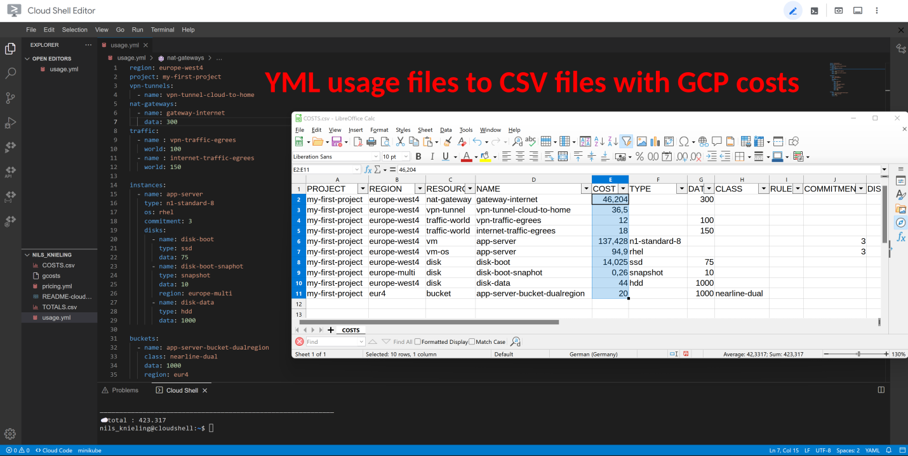

# Google Cloud Platform Pricing and Cost Calculator

Calculate estimated monthly costs of Google Cloud Platform products and resources.
Optimized for DevOps, architects and engineers to quickly see a cost breakdown and compare different options upfront.
Mapping of resource usage is done in easy to learn YML files.
Price information is read from a local file.
Full control and no disclosure of any information and costs to third parties.
Everything tested and matched against the actual invoice in large Google Cloud migration projects.



## ☁️ Supported resources

The cost of a resource is calculated by multiplying its price by its usage.

| :information_source: Google Cloud Free Program |
|------------------------------------------------|
| Free tiers and free trial (90-day, $300), which are usually not a significant part of cloud costs, are ignored. For example: 1x free non-preemptible `e2-micro` VM instance per month, free NAT for 32 VMs, 30 GB-months standard persistent disk, 1 GB network egress and everything [else](https://cloud.google.com/free/docs/gcp-free-tier/#compute) are not taken into account. |

Resources that `gcosts` supports, and Google charges for:

* 🖥️ Compute Engine Instances
	* All machine types are supported
		* Cost-optimized (`E2`, `F1`, `G1`)
		* Balanced (`N1`, `N2`, `N2D`)
		* Scale-out optimized (Tau `T2D`)
		* Memory-optimized (`M1`, `M2`)
		* Compute optimized (`C2`, `C2D`)
		* Accelerator optimized (`A2`)
	* Sustained use discounts are applied to monthly costs
	* 1 year and 3 year commitments are supported	
	* Paid "premium" operating system licenses (paid images) are supported
		* SUSE Linux Enterprise Server
		* SLES for SAP
			* 1y and 3y commitments is also supported
		* Red Hat Enterprise Linux
		* RHEL for SAP
		* Windows Server
	* Custom machine types are supported (have to be created manually)
	* Spot and sole-tenant VMs are not supported
* 💾 Compute Engine Disks
	* All persistent disk (PD) types are supported
		* Zonal persistent disk
		* Regional persistent disk
		* Local SSD
* 🪣 Cloud Storage
	* All storage classes and location types are supported
		* region
		* dual-region
		* multi-region
* 🚇 Cloud VPN
* 🔗 Cloud NAT
* 🤹 Cloud Load Balancing
* 🚦 Cloud Monitoring (Operations Suite)
	* Monitoring data
* 🕸️ Network 

The following services are not currently supported, but are on the TODO list:

* BigQuery
* Cloud SQL

## 🧑‍🏫 Start the interactive tutorial

This guide is available as an interactive Cloud Shell tutorial.
To get started, please click the following button:

[](https://shell.cloud.google.com/cloudshell/open?cloudshell_git_repo=https://github.com/Cyclenerd/google-cloud-pricing-cost-calculator&cloudshell_git_branch=master&cloudshell_tutorial=cloud-shell-tutorial.md)

## 🏃 Quick start

### 1. Get `gcosts` program

[Download](https://github.com/Cyclenerd/google-cloud-pricing-cost-calculator/releases/latest) the executable `gcosts` program.

Linux (x86_64) / Cloud Shell:
<!-- https://github.com/Cyclenerd/google-cloud-pricing-cost-calculator/releases/latest/download/gcosts -->
```shell
curl -OL "https://bit.ly/gcosts" && \
chmod +x gcosts && \
./gcosts --help
```

### 2. Download price information

[Download](https://github.com/Cyclenerd/google-cloud-pricing-cost-calculator/raw/master/pricing.yml) the latest and tested price information file `pricing.yml`.

Linux / Cloud Shell:
```shell
curl -L "https://bit.ly/pricing_yml" \
     -o "pricing.yml"
```

### 3. Run it

Create your first usage file (`usage.yml`):
```yml
region: europe-west4
project: my-first-project
instances:
  - name: app-server
    type: e2-standard-8
    os: rhel
    commitment: 3
    disks:
      - name: disk-boot
        type: ssd
        data: 75
```

Run the program:
```shell
./gcosts
```

All YML files of the current directory are processed.

Two CSV files with the costs are created:

1. `COSTS.csv`  : Costs for the resources
1. `TOTALS.csv` : Total costs per name, resource, project, region and file.

You can import the CSV files with MS Excel, LibreOffice or Google Sheets.

### 4. Get familiar

Continue to familiarize yourself with the options. The following documentations are prepared for this purpose:

* [Create usage files](usage/)
* [Build pricing information file](build/)

**🤓 Pro Tip**

Add `gcosts` to your Bash aliases with absolute pathnames. You can then execute `gcosts` anywhere.

Alias (`~/.bash_aliases`):
```shell
alias gcosts='/your-pathname/gcosts -pricing=/your-pathname/pricing.yml'
```


## 🧑‍💻 Development

If you want to modify the Perl scripts or prefer to run the uncomplicated Perl scripts (`gcosts.pl`, `skus.pl`, `mapping.pl`, `pricing.pl`) and create the price information yourself,
the following requirements are needed.

Perl 5 is already installed on many Linux (Debian/Ubuntu, RedHat, SUSE) and UNIX (macOS, FreeBSD) operating systems.
For MS Windows you can download and install [Strawberry Perl](https://strawberryperl.com/).

### Requirements

* Perl 5 (`perl`)
* Perl modules:
	* [App::Options](https://metacpan.org/pod/App::Options)
	* [LWP::UserAgent](https://metacpan.org/pod/LWP::UserAgent)
	* [JSON::XS](https://metacpan.org/pod/JSON::XS)
	* [YAML::XS](https://metacpan.org/pod/YAML::XS) (and `libyaml`)
	* [DBD::CSV](https://metacpan.org/pod/DBD::CSV)

Debian/Ubuntu:
```shell
sudo apt update
sudo apt install \
	libapp-options-perl \
	libwww-perl \
	libjson-xs-perl \
	libyaml-libyaml-perl \
	libdbd-csv-perl
```

Or install Perl modules with cpanminus:
```shell
cpan App::cpanminus
cpanm --installdeps .
```

### Packager

Create the standalone executables `gcosts` program.

Requirement:
```shell
sudo apt install libpar-packer-perl
```

Pack `gcosts.pl` into executable `gcosts` (or `gcosts.exe` on Win32):
```shell
pp -vvv -l libyaml-0.so.2 -o gcosts gcosts.pl
```

## ❤️ Contributing

Have a patch that will benefit this project?
Awesome! Follow these steps to have it accepted.

1. Please read [how to contribute](CONTRIBUTING.md).
1. Fork this Git repository and make your changes.
1. Create a Pull Request.
1. Incorporate review feedback to your changes.
1. Accepted!


## 📜 License

All files in this repository are under the [Apache License, Version 2.0](LICENSE) unless noted otherwise.

Please note:

* No warranty
* No official Google product